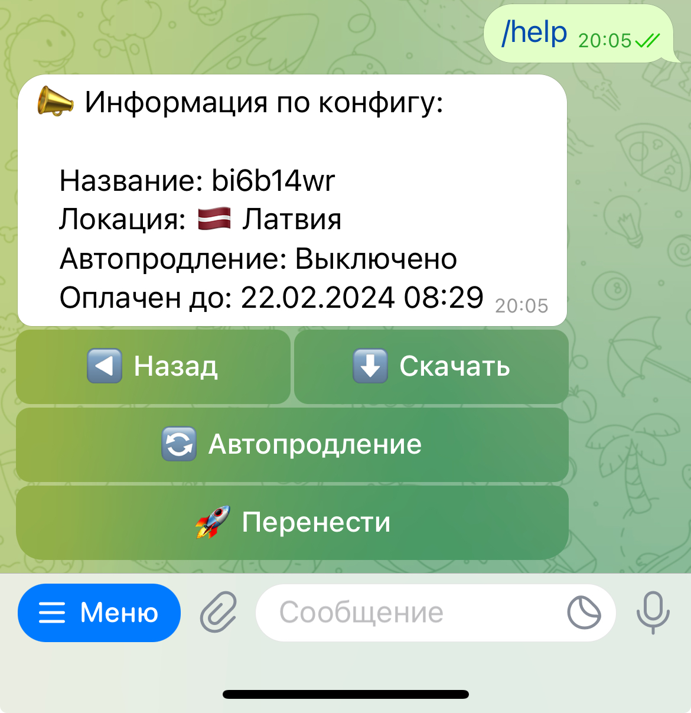
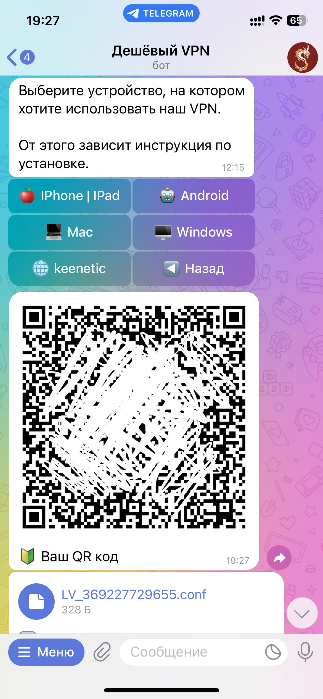

### Дисклеймер

> Использование VPN должно соответствовать законам Российской Федерации и исключать любые вредоносные действия, массовые рассылки или нарушения законодательства.

##  Несколько слов

Из-за известных проблем в моей стране, возросла потребность в качественном VPN. На рынке было много подобных сервисов, но все они
были либо дорогими, либо качество у них было на уровне бесплатных. Поначалу я использовал Wireguard VPN который настраивался вручную и
это было неудобно, клиентов было уже достаточно и я решил что нужно двигаться дальше. На просторах интернета я нашел OpenSource
[проект](https://github.com/wg-easy/wg-easy) с красивым и простым web интерфейсом. Но время шло и мне это тоже наскучило.
Я подумывал сделать Telegram бота, чтобы это всё автоматизировать и да у меня это в очередной раз получилось. Я написал свою библиотеку для
работы с `wg-easy`: [wg-easy-wrapper](https://github.com/megoRU/wg-easy-wrapper) и [3x-ui](https://github.com/megoRU/3x-ui-wrapper). А далее оставалось только сделать Telegram бота. И спустя месяцы я уже выкатил
стабильную сборку на прод и конверсия клиентов возросла в `1000 %`. Это самый успешный коммерческий проект, который я создал.

##  Как реализован?

Как обычные Telegram боты. Использовал несколько паттернов программирования, а именно: `Наблюдатель` и `Фабрику`. 
Наблюдатель я использовал для взаимодействия с API `wg-easy/3x-ui`. `Включить`/`выключить`/`создать` `config` и многое другое.

> Часть кода для работы наблюдателя

```
public interface ListenerAdapter {

    void onDisableClient(@NotNull ClientState clientState, UpdateController updateController);
    void onEnableClient(@NotNull ClientState clientState, UpdateController updateController);
    void onDeleteClient(@NotNull ClientState clientState, UpdateController updateController);
    void onExtend(@NotNull BillingData billingData, UpdateController updateController);
    void onBuy(@NotNull BillingData billingData, UpdateController updateController);
    void onRefill(@NotNull BillingData billingData, UpdateController updateController);
    void onBillExpired(@NotNull BillingData billingData);
    void onRenewal(@NotNull ClientRenewal clientRenewal, UpdateController updateController);
    void onVPNExpire(@NotNull ClientWg clientWg, UpdateController updateController);
    void onLinked(@NotNull ClientChatId clientChatId, UpdateController updateController);
    String onCreate(@NotNull CreateConfig createConfig, UpdateController updateController);
}
```

## А хоть картинки то покажешь?

Да.

Вот UML диаграмма работы бота. (Устарела немного)


Панель управления конфигом



Скачивание конфига для WireGuard

