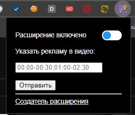
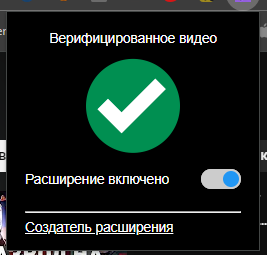
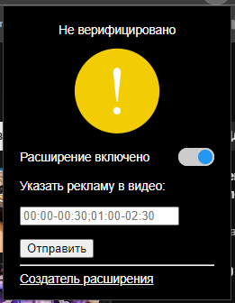

### Дисклеймер

> Да я знаю что давно уже есть аналог, я решил углубиться в создание расширений для Chrome поэтому мне было всё равно. 
> [SponsorBlock](https://sponsor.ajay.app). Моё приложение доступно тут: [YouTubeAdSkipper](https://github.com/megoRU/YouTubeAdSkipper)

## Что за расширение ты делаешь?

Идею для расширения в браузере я вынашивал примерно два года, несмотря на ограниченное свободное время из-за инвестиций 
и коммерческих проектов. Наконец, удалось приступить к реализации. Позвольте перейти от вступления к сути.

Расширение предназначено исключительно для YouTube, его основной функцией является автоматическое пропускание 
встроенной рекламы от авторов. Это своего рода AdBlock на максималках, который поддерживается сообществом, но об этом я расскажу чуть позже.

## Как реализован?

Реализовано с использованием нативного JavaScript. Возможно, в будущем перепишу на TypeScript, так как он ближе к идеологии Java. 
Позвольте сразу сказать, что мой уровень знания JavaScript находится на начальном уровне, поэтому некоторый "говнокод" неизбежен.

При открытии любого видеоролика, скрипт запрашивает у моего API данные о времени появления рекламы в ролике. 
Если пользователь досмотрел видео до момента рекламы, она автоматически пропускается. Если при запросе к API не нашло данных,
то расширение предложит добавить вручную, и эти данные уже будут валидны для последующих пользователей, но с пометкой не верифицировано.

## Картинки

Меню добавления таймкодов

Так выглядит верифицированное видео

Так выглядит меню видео на модерации

