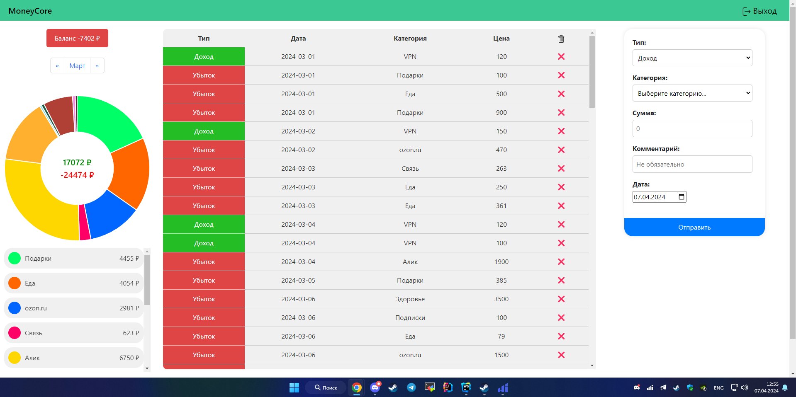
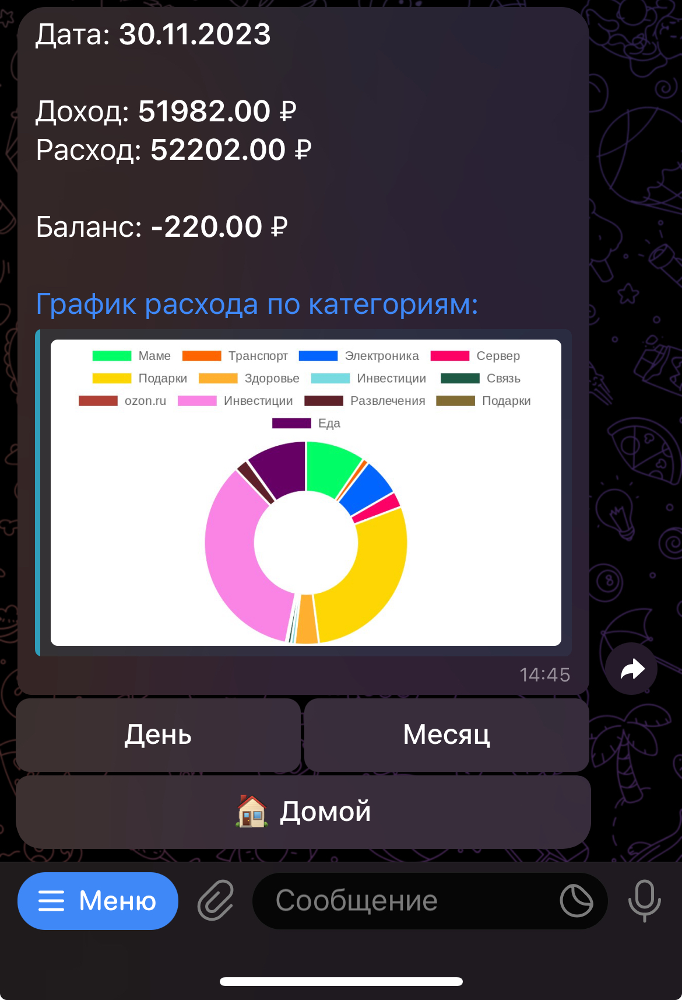

## Вступление

Изначально этот проект был реализован в виде Telegram-бота, однако позже было принято решение перенести его на веб-платформу. 
Возникла идея создать конкурентоспособный сервис среди аналогичных. В нашем проекте уже реализован функционал семейного счета, 
а также множество других возможностей.

## Как реализован?

Для API был выбран Spring Boot, а для SSR (Server-Side Rendering) - React.js. 
В рамках проекта было принято решение отойти от традиционного создания учетных записей. Вместо этого предусмотрена авторизация через Telegram.

## А хоть картинки то покажешь?

Web версия: 

## Как выглядел проект в реализции Telegram-бота (больше не поддерживается)

Статистика за месяц:

Транзакции за день:

## Какое будущее у проекта?

Много чего запланировано, например редактирование транзакций, перенос на другой день и так далее.
В планах перейти на своё решение для построения графиков.